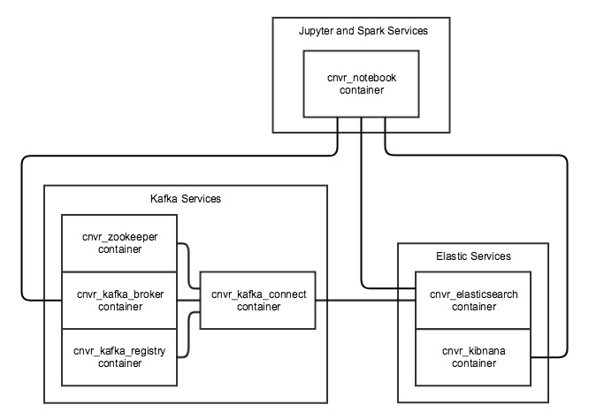

# Docker containers for ElasticSearch and Kafka using Compose.

A simple docker compose script to stand up what is needed to work with Kafka, ElasticSearch and Kibana

Before running the containers, please allocate **at least 6GB of memory** to docker (8GB of memory is recommended).

To get the containers running they will need to be created.
* docker-compose up -d

Once created they can be started/stopped with
* docker-compose start
* docker-compose stop

When you are done with them `docker-compose rm -s` will stop and remove the containers.  The kafka broker and elasticsearch containers will leave behind a data directory once they are removed.  This is found under this current path in the directory named `data`.  This can be safely removed after the containers are removed.

## Kafka

To use the kafka tools, run them through the docker container 

* `docker exec -ti cnvr_kafka_broker kafka-topics --zookeeper zookeeper:2181 --list`

### Kafka Connect

Kafka Connect is available on port 8083 on the localhost.

### Kafka Schema Registry

The schema registry is available on port 8081 on the localhost.

## ElasticSearch & Kibana

The Kibana interface is running on port 5601 on the localhost.

* Kibana
* http://localhost:5601

* ElasticSearch
* http://localhost:9200

## Jupyter Notebook

Jupyter notebook is available on port 8888 on the localhost.  The password for the environment is empty and clickinging on "Log in" will open the notebook session.  There is a local volume mounted under ./src/jupyter which is where the notebooks reside for the image.

 * http://localhost:8888/tree?
 * http://localhost:8888/lab?
